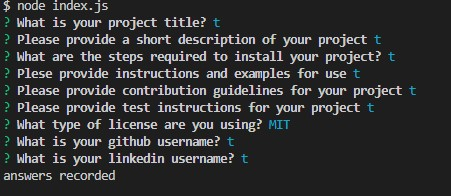

# README-generator
  ## Description
  This application is a README generator that takes user input and generates a .md file in correct markdown formatting. 
  ## Installation
  This application uses node v16.18.0 and requires the inquirer package. 
  ## Usage
  Once the application is initialized, a series of prompts will appear. Answer the questions for each README section and select a license from the list of options. Once the prompts are completed, a file titled "YourREADME.md" will appear. A license badge for your chosen license will appear at the top, followed by a description and a linked table of contents. The questions section will contain a link to your GitHub as well as your email address. 
  The image below shows the user input in the terminal:   
    

  ## License
  MIT license